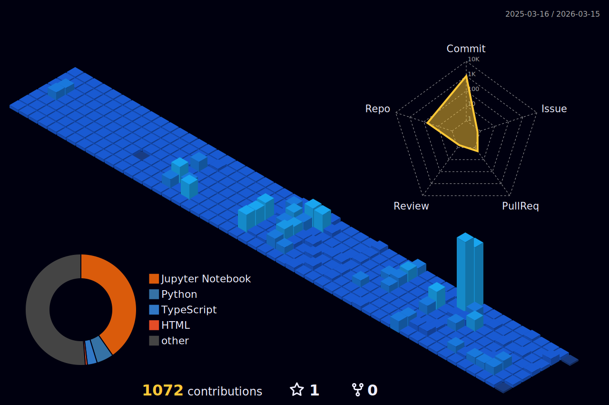

</image>

<h3 align=center> 
🌱 Hello🖐 I’m Dohyung from Seoul, Korea.
</h3>

I used to major in business administration, but now I dream of becoming a data analysis & engineer in marketing & finance.

 

	

<h3 align="center">📚 Tech Stack 📚</h3>

	
	
	
	
 	
	
<!-- 	
	 
 	
 	
 -->
	

	<h3> 🐣 Social 🐣 </h3>	
	

