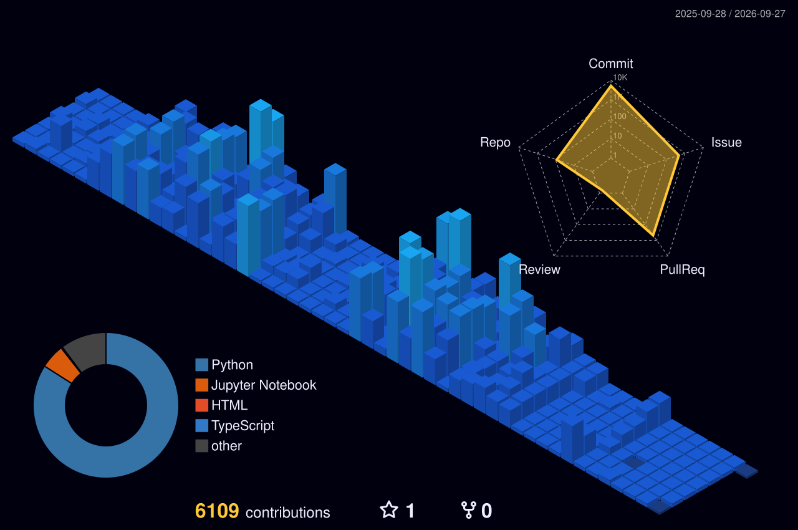

  

<h3 align="center">🌱 Hello, I'm Dohyung 🖐</h3>

  <strong>AI Agent · RAG · Multimodal AI</strong>

  🇰🇷 <strong>한국어</strong> 
  경영학을 전공했으며, 현재 통계·데이터과학을 공부하고 있습니다. 
  AI Agent Engineer를 목표로 <strong>RAG, LLM, 멀티모달 AI, Agent Workflow</strong>를 중심으로 학습하고 프로젝트를 개발하고 있습니다.

  🇺🇸 <strong>English</strong> 
  I majored in Business Administration and am currently studying Statistics and Data Science. 
  I am working toward becoming an <strong>AI Agent Engineer</strong>, focusing on <strong>RAG, LLMs, multimodal AI, and agentic workflows</strong>.

---

<h2 align="center">🚀 Projects &amp; Learning</h2>

### 📖 학습 내용 · Learning

- **[Inch_by_inch](https://github.com/figure-2/inch_by_inch)**
  - 🇰🇷 TIL 정리 및 학습 내용 기록
  - 🇺🇸 Today I Learned (TIL) notes and learning resources

---

### 🌟 대표 프로젝트 · Featured Projects

#### [LocalLens](https://github.com/figure-2/LocalLens) · 로컬 멀티모달 검색

- 🇰🇷 로컬 텍스트·이미지·PDF를 자연어로 검색하는 멀티모달 Retrieval 서비스
- 🇺🇸 A multimodal retrieval service for searching local text, images, and PDFs using natural language

#### [SeSAC-Note](https://github.com/figure-2/SeSAC-Note) · 강의 영상 AI 노트

- 🇰🇷 강의 영상의 음성·화면·시간 정보를 구간별 근거 맥락으로 구성해 AI 노트와 근거 기반 Q&A를 제공하는 멀티모달 AI 서비스
- 🇺🇸 A multimodal AI service that organizes lecture audio, on-screen content, and timestamps into segment-level context for AI-generated notes and evidence-based Q&A

#### [PlanWeave](https://github.com/figure-2/planweave) · 에이전틱 문서 설계

- 🇰🇷 기획이음(PlanWeave): 아이디어·리서치·기획·편집을 연결하는 LangGraph 기반 에이전틱 문서 설계 도구
- 🇺🇸 PlanWeave: A LangGraph-based agentic document design tool connecting ideation, research, planning, and editing

#### [Financial-Insight-Agent](https://github.com/figure-2/Financial-Insight-Agent) · 근거 기반 기업분석

- 🇰🇷 금융 리포트 RAG, 공시·법령 근거, 시장·포트폴리오 분석을 출처와 함께 통합하는 근거 기반 기업분석 포트폴리오 프로젝트
- 🇺🇸 An evidence-based company analysis portfolio project integrating financial report RAG, corporate disclosures, legal sources, and market and portfolio analysis with source citations

---

### 🛠️ 기타 프로젝트 · Other Projects

<strong>프로젝트 5개 펼쳐보기 · View 5 more projects</strong>

 

- **[MULTI_PJT2_4.5HZ](https://github.com/figure-2/MULTI_PJT2_4.5HZ)**
  - 🇰🇷 '4.5HZ' 글로벌 음악 데이터 분석과 사용자 맞춤 음악 추천 서비스
  - 🇺🇸 '4.5HZ' Global music data analysis and personalized music recommendation service

- **[Visually_Impaired_Service](https://github.com/figure-2/Visually_Impaired_Service)**
  - 🇰🇷 시각장애인을 위한 안내 서비스
  - 🇺🇸 A navigation service for visually impaired users

- **[Financial-Agent](https://github.com/figure-2/Financial-Agent)**
  - 🇰🇷 자연어 질문으로 주식 시장의 다양한 금융 정보를 조회하는 금융 Agent
  - 🇺🇸 A financial agent for querying various types of stock market information using natural language

- **[History_Docent](https://github.com/figure-2/History_Docent)**
  - 🇰🇷 History Docent — 한국사 교육 및 도슨트를 위한 RAG 기반 AI 서비스
  - 🇺🇸 History Docent — A RAG-based AI docent service for Korean history education

- **[Insurance_PF](https://github.com/figure-2/Insurance_PF)**
  - 🇰🇷 개인용 자동차 보험 특화 LLM (Auto Insurance Specialist Agent) / LLM 파인튜닝
  - 🇺🇸 An LLM specialized in personal auto insurance (Auto Insurance Specialist Agent) / LLM fine-tuning

---

<h2 align="center">📚 Tech Stack</h2>

| 분야 | 기술 |
| :--- | :--- |
| **AI · LLM** |     |
| **Agent · LLM API** |     |
| **Retrieval · Vector Search** |    |
| **Multimodal · Document AI** |     |
| **Backend · Application** |     |
| **Frontend** |    |
| **Database** |     |
| **Cloud · Infrastructure** |    |
| **Development Tools** |    |

**적용 기법 · Methods**  
`RAG` · `BM25` · `Multimodal Retrieval` · `LLM Fine-tuning` · `Agentic Workflows`

---

<h2 align="center">🐣 Social</h2>

  
  &nbsp;
  

 

  

